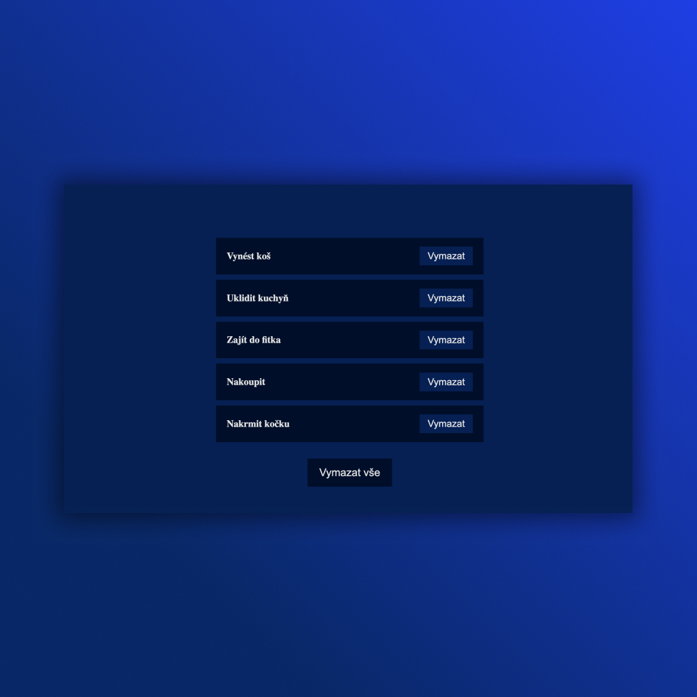

## Task App
• useState, map, filter, destructuring ✅

## Screenshots 📱

## 💻 Tech Stack

## 🌐 Link
<a href="https://task-app-dejvcodes.netlify.app/">React-Hooks</a>

## License🔐
[MIT License](LICENSE)